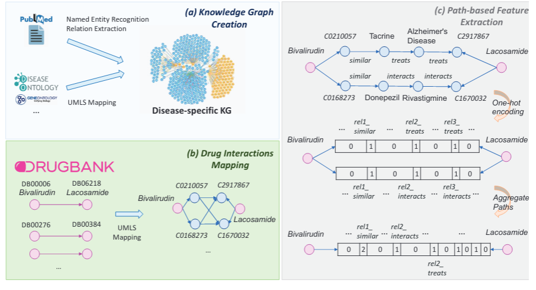
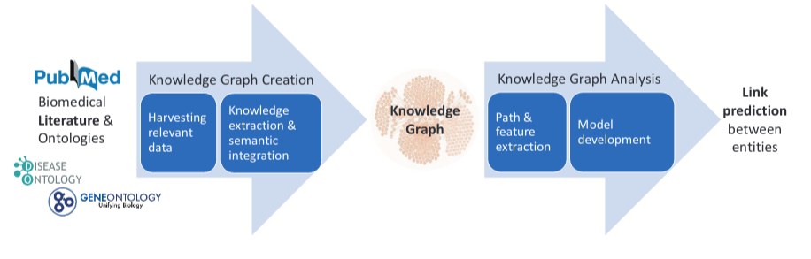
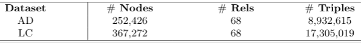
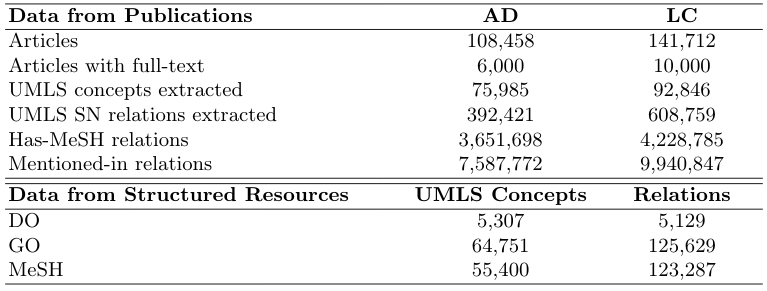

# Drug-Drug Interaction Prediction on a Biomedical Literature Knowledge Graph (DDI-BLKG)
Predicting probable drug-drug interactions (DDIs) based on a literature-KG graph.

This is the code repo with model and materials for the corresponding work:
[Drug-Drug Interaction Prediction on a Biomedical Literature Knowledge Graph](https://link.springer.com/chapter/10.1007/978-3-030-59137-3_12) presented in [AIME2020](https://aime20.aimedicine.info/).

Our model is based on extracting the semantic paths that connect two drug nodes in a KG. The KG is disease-specific and based on biomedical literature and manually annotated DBs such as [D0](https://disease-ontology.org/), [G0](http://geneontology.org/) and [MeSH](https://www.nlm.nih.gov/research/umls/sourcereleasedocs/current/MSH/index.html). A overview of this process can be seen in the following picture:





In this repository exists  a sample script (*run\_tests*) to replicate the results comparing the different methodologies presented.

Moreover, a notebook for data exploration is provided in the examples folder.

For the full workflow of creating the knowledge graph one should also visit
the [Biomedical Knowledge Integration repo](https://github.com/tasosnent/Biomedical-Knowledge-Integration) for setting up the Harvesters and the Extraction/Indexing Tools.


This is a work in progress. Feel free to contact me if anything is amiss.

## Overview

This work presents a new paradigm for predicting probable DDIs by tackling the problem, as a link-prediction task between drugs in a biomedical KG. The KG is disease-specific and is created by harvesting and analyzing biomedical literature and structured databases as in the following:




### Data:

In order to run the script you will need to download the created dataset (drug pairs and embeddings) and place them in the *data/Embeddings* folder.

More specifically you need to download [from here](https://owncloud.skel.iit.demokritos.gr/index.php/s/WFpHQ6aegYK1J7M):
 
 - The feature vectors for the drug pairs for the DDI_BLKG method. Download them from [here](https://owncloud.skel.iit.demokritos.gr/index.php/s/82I5Wtm9OlZa1mC)
 - The graph embeddings of the drug pairs for the different competing methods. Download them from the corresponding links:
	 1. [TransE](https://owncloud.skel.iit.demokritos.gr/index.php/s/V5MwpsvbFqgzk1j)
	 2. [HolE](https://owncloud.skel.iit.demokritos.gr/index.php/s/ZBUlt41JsGoikRB)
	 3. [DistMult](https://owncloud.skel.iit.demokritos.gr/index.php/s/ktI92u0XeLexzlR)
	 4. [RESCAL](https://owncloud.skel.iit.demokritos.gr/index.php/s/V5MwpsvbFqgzk1j)
 
As mentioned before, Place all downloaded files in the *data/Embeddings* folder

The graph embeddings have been created using [TorchKGE](https://torchkge.readthedocs.io/en/latest/) and have been generated using the KGs in the form of semantic triples (i.e. subject - relation - object). The KGs for the two diseases in this form  can be found in the following links for further experimentation:

 - [Alzheimer's Disease KG](https://owncloud.skel.iit.demokritos.gr/index.php/s/Flt5dqqUEwac3H5)
 - [Lung Cancer KG](https://owncloud.skel.iit.demokritos.gr/index.php/s/V40tNlo8xc4AmYA)
 
The details regarding the two KGs in terms of size, can be seen in the following table:




These were created by harvesting related publications and the aforementioned structured DBs. More details regarding the different data sources and the number of knowledge items fetched from each one can be seen in the following table:




### Predicted DDIs:
In the *data/Predictons* folder you can also find the probable DDIs found for both diseases.


**UPDATE COVID-19 (08/05/2020)**: We have also added probable DDIs related to the COVID-19 disease. This was done by utilizing the existing KGs and taking the subset of the drugs that were deemed relevant to the disease. In the future, a COVID-19-specific KG will be generate better DDIs.

### Requirements:
Install the requirements

pip install -r requirements.txt

### Module:

You can also install the module if you would like to check it out from ipython.
```sh
git clone https://github.com/kbogas/DDI_BLKG.git
cd DDI_BLKG
pip install --user .
```


## Example usage:
Run the following to generate the results as reported in our studies:
```python
python run_experiment_AIME2020.py
```

## Tests

Currently no tests supported.

## Questions/Errors
Bougiatiotis Konstantinos, NCSR ‘DEMOKRITOS’ E-mail: bogas.ko@gmail.com

